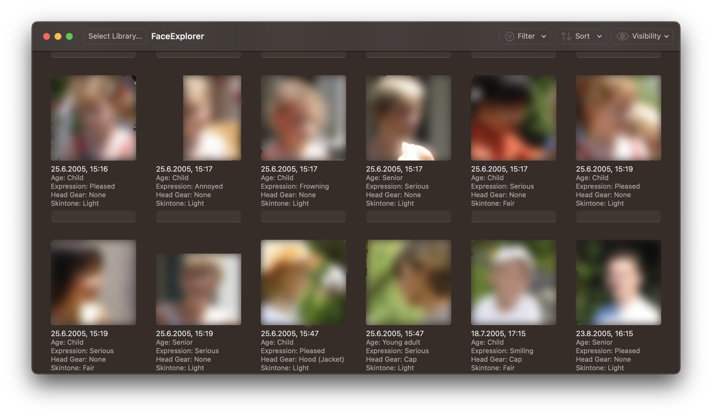

# FaceExplorer for macOS (WIP)

### Warning: Although everything should be safe, I am not responsible for any data loss - proceed at your own risk

This project is my first macOS application in Swift.
I like organizing my photos but became frustrated with the face-tagging interface provided by the default macOS Photos app.
In particular, I found it hard to find "untagged" Photos.

I created this app to remedy this issue.
During the process of reverse engineering the .photoslibrary database, I discovered that the Photos app has a wealth of information at its disposal regarding user photos.
In fact, it predicts various attributes such as gender and facial expression for each face.

## Key Features

- View and filter all untagged faces in your library
- Shows predicted attributes such as gender and facial expression for each face
- Creating new albums with untagged faces or based on other attributes (thanks to @dxclancy!)
- (Work in progress) Enables users to assign names to the faces right from the app. This is a bit scary because it requires writing to the photos library database.
